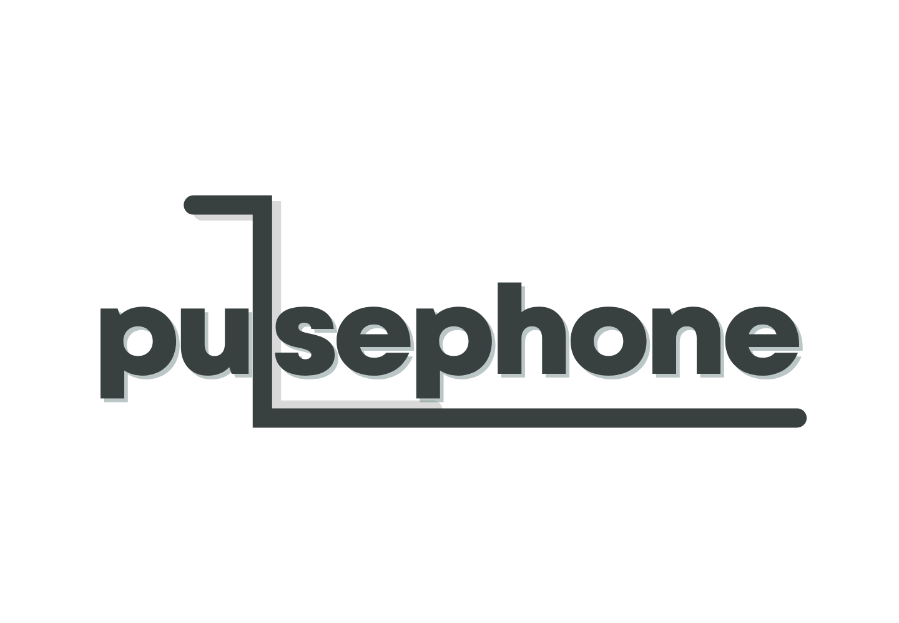

# PulsePhone — Pulse Modular Phone (MCM-iMX93 SoM)

> A modular, open-source smartphone built for repairability, upgradability, and hardware freedom.

Built around the **MCM-iMX93 System-on-Module**, PulsePhone uses **Hirose DF40** board-to-board connectors across all subsystems — keeping modules isolated, swappable, and independently developable.

---

## System Architecture

The **Main Board** is the hub of the system, hosting the MCM-iMX93 SoM, an onboard DAC, and all signal routing. Every peripheral connects to it via DF40 connectors.

| Module          | Interface         | Role                                        |
|-----------------|-------------------|---------------------------------------------|
| Main Board      | DF40 (host)       | MCM-iMX93 SoM, DAC, signal routing          |
| Display Module  | MIPI/LVDS + Touch | Adapter for wide MIPI-DSI display compat.   |
| Wi-Fi / BT      | SDIO / UART       | Wireless radio                              |
| Audio Module    | Analog            | Amp, speaker, headphone, mic interface      |

Full connector pinout in [MBI-Lite Specification](MBI-LITE.md).

---

## Project Goals

- One connector standard (DF40) across every module
- Analog audio path — simpler layout, better signal integrity
- Linux (Debian + Phosh), Android, and Ubuntu Touch compatible
- Fully open: KiCad source + mechanical files under GNU GPL-V3.0

---

## Development Notes

### Main Board
> Second Revision/V2!
> Revamping design.
> PCB Design DONE!

### Wi-Fi / Bluetooth Module
> Not here yet.

### Display Module
> PCB Design DONE!
> This module acts like an adapter, so PulsePhone can have a wide range of MIPI-DSI displays to be compatible with.

### Camera Module
> Design TBD

### Audio Module
> Design TBD

---

## Current Project Status

- Not ready to boot anything
- Working on design for main board.

---

## Documentation

- [MBI-Lite Module Connector Specification](MBI-LITE.md)
- [Contributing](CONTRIBUTING.md)
- [License](LICENSE)

---

## License

Hardware released under **GNU GPL-V3.0**.
